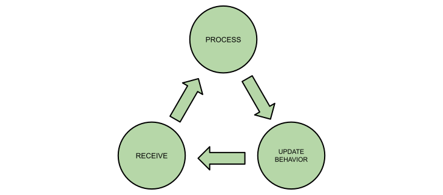

Actors are higher level concurrency models which receive messages, process them and update their internal state.
Within processing actor can spawn finite number of children actors and send finite number of messages to other actors.  

This can be visualized as a simple diagram:



## Usage

The basic actors usage requires defining a `Stateful` for describing actor's behavior.
Then actor's creation is done with passing supervision manner, initial state and mentioned `Stateful`.

Imports required for example:

```scala mdoc:silent
import java.io.File

import zio.actors.Actor.Stateful
import zio.actors._
import zio.IO
```

Our domain that will be used:

```scala mdoc:silent
sealed trait Command[+_]
case class DoubleCommand(value: Int) extends Command[Int]
```

Our actor's assigment will be to double received values. Here's the `Stateful` implementation:

```scala mdoc:silent
val stateful = new Stateful[Unit, Throwable, Command] {
  override def receive[A](state: Unit, msg: Command[A], context: Context): IO[Throwable, (Unit, A)] =
    msg match {
      case DoubleCommand(value) => IO.effectTotal(((), value * 2))
    }
}
```

Then we are ready to instantiate the actor and fire off messages:

```scala mdoc:silent
for {
  system <- ActorSystem("mySystem")
  actor <- system.make("actor1", Supervisor.none, (), stateful)
  doubled <- actor ! DoubleCommand(42)
} yield doubled
```

This is `fire-and-forget` interaction pattern where caller is blocked until recipients confirms enqueueing message in mailbox queue.
There's also `ask` interaction pattern where for caller sending a message is completed after receiving response message from recipient.
It's performed via `?` method.

From recipient's point of view these two interaction patterns are indistinguishable. 

### Configuration

For each `ActorSystem` created there should be a config entry in configuration file. 
By default configuration file is expected to be at `./src/main/resources/application.conf`. 
Exemplary configuration entry for an `ActorSystem` named `Test1`:

```hocon
Test1.zio.actors.remoting {
  hostname = "127.0.0.1"
  port = 1234
}
```

Custom configuration file can be provided when instantiating `ActorSystem`:

```scala mdoc:silent
ActorSystem("mySystem", Some(new File("./my/custom/path/app.conf")))
```
